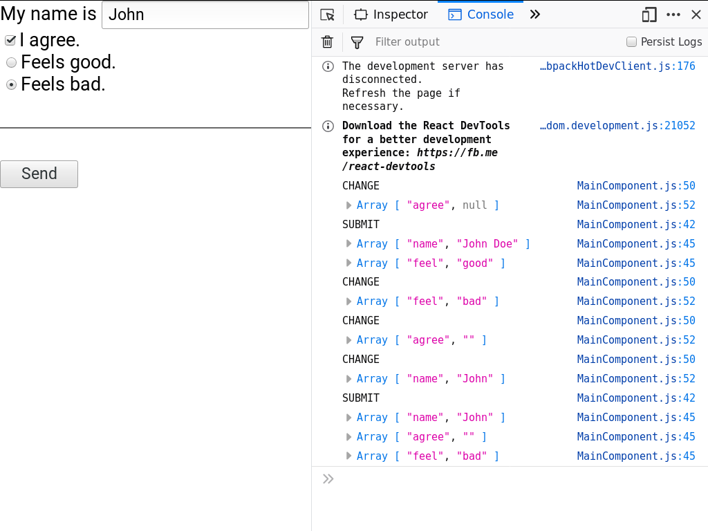

# react-uncontrolled-forms

Uncontrolled React forms inside a Redux boilerplate. With SASS, Gradle and
Docker images for development and production.



## Installation

Start by downloading and building the project when necessary. The following
commands will do the job on most Debian based Linux distributions.

```bash
git clone https://github.com/mbpez/react-uncontrolled-forms
cd react-uncontrolled-forms
sudo -HE ./gradlew
```

## Usage

NPM will start a development server on port 3000 with `npm start`. You may
alternatively run the production build generated above with `npm run build`.

## Testing

Test checks are executed automatically every time the project is built. Builds
can be done remotely or continuously on a development context. For continuous
integration and development use docker-compose. This is recommended to keep the
system clean while the project is built every time the sources change.

```bash
# Build the project and test the development image at http://localhost:3000.
sudo docker-compose up builder
```

For continuous integration and development without any dependencies use the
Gradle wrapper. This is the best option if the wrapper is available and the
Docker context is not valid. For a full list of tasks, see
`sudo ./gradlew tasks --all`. For a CI cycle use `sudo ./gradlew --continuous`.

For continuous integration and development without Docker or the project wrapper
use Gradle directly. This will create the wrapper in case it is not present.
Similar to the above, for a CI cycle use `sudo gradle --continuous`. Gradle
3.4.1 is required for this to work. Plain Docker is also available for remote
integration tasks and alike. Build the image with `sudo docker build .` and run
a new container with it. Information on how to install Docker and docker-compose
can be found in their [official page][install-docker-compose]. A similar
installation guide is available [for Gradle][install-gradle].

## Deployment

The example below will build the `runner` image, a pre-configured Nginx
container with the built project. You may want to add a Docker registry to
`docker-compose.yml` and push the built image.

```bash
# Build the project and test the development image at http://localhost:3000.
sudo docker-compose up builder

# Test the deployment image at http://localhost:8080.
sudo docker-compose up runner

# Push the deployment image.
sudo docker-compose push runner
```

## Troubleshooting

The [issue tracker][issue-tracker] intends to manage and compile bugs,
enhancements, proposals and tasks. Reading through its material or reporting to
its contributors via the platform is strongly recommended.

## Contributing

This project adheres to [Semantic Versioning][semver] and to certain syntax
conventions defined in [.editorconfig][editorconfig]. To get a list of changes
refer to the [CHANGELOG][changelog]. Only branches prefixed by *feature-*,
*hotfix-*, or *release-* will be considered:

  - Fork the project.
  - Create your new branch: `git checkout -b feature-my-feature develop`
  - Commit your changes: `git commit -am 'Added my new feature.'`
  - Push the branch: `git push origin feature-my-feature`
  - Submit a pull request.

## Credits

This project is created by [mbpez][author] and maintained by its
[author][author] and contributors.

## License

This project is licensed under the [Apache License Version 2.0][license].

[author]: https://mbpez.github.io
[issue-tracker]: https://github.com/mbpez/react-uncontrolled-forms/issues
[editorconfig]: .editorconfig
[changelog]: CHANGELOG.md
[license]: LICENSE
[semver]: http://semver.org
[install-docker-compose]: https://docs.docker.com/compose/install/
[install-gradle]: https://gradle.org/install
